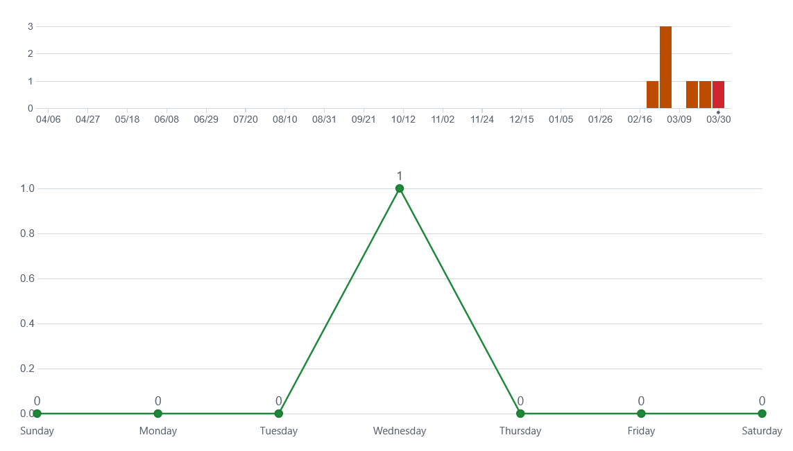
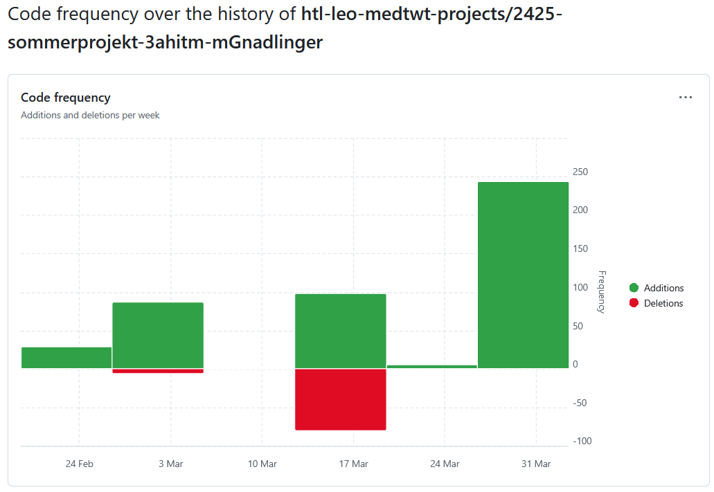
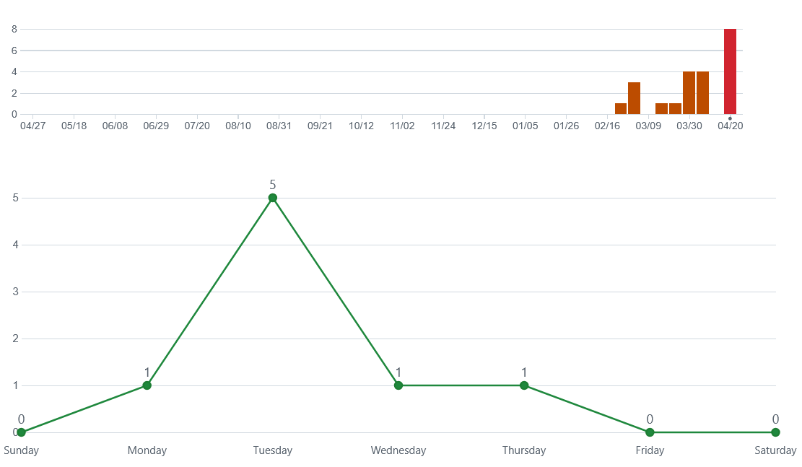
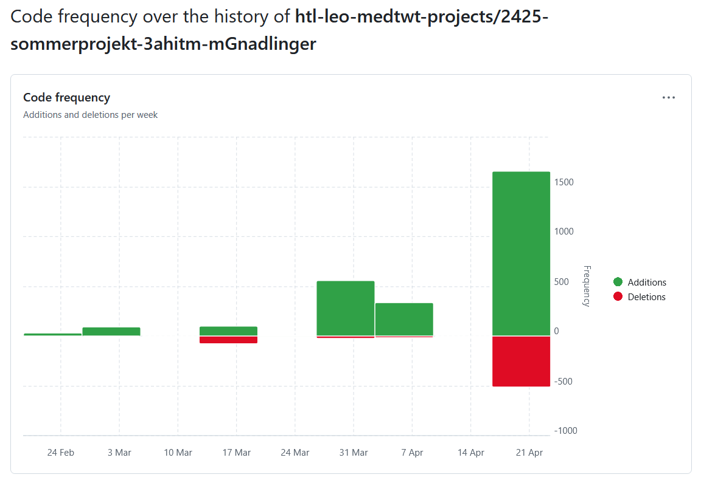
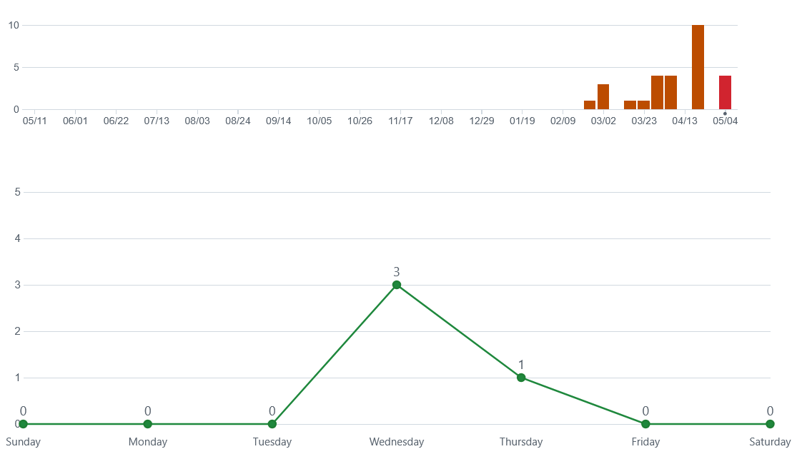
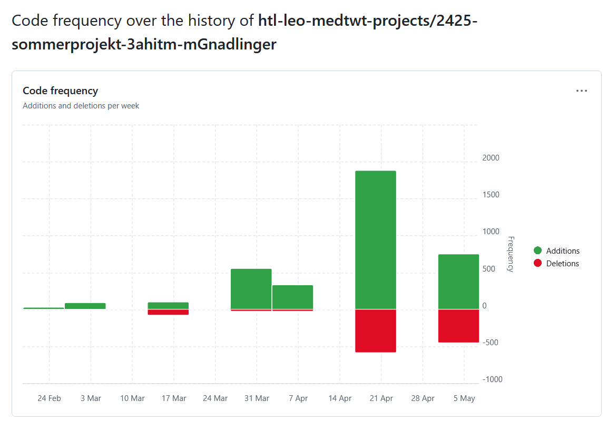
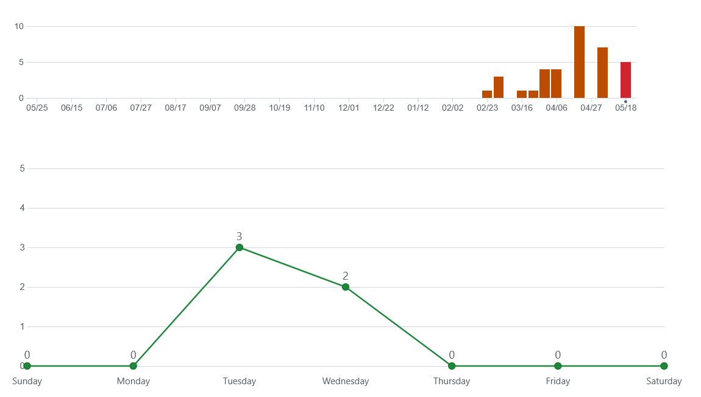
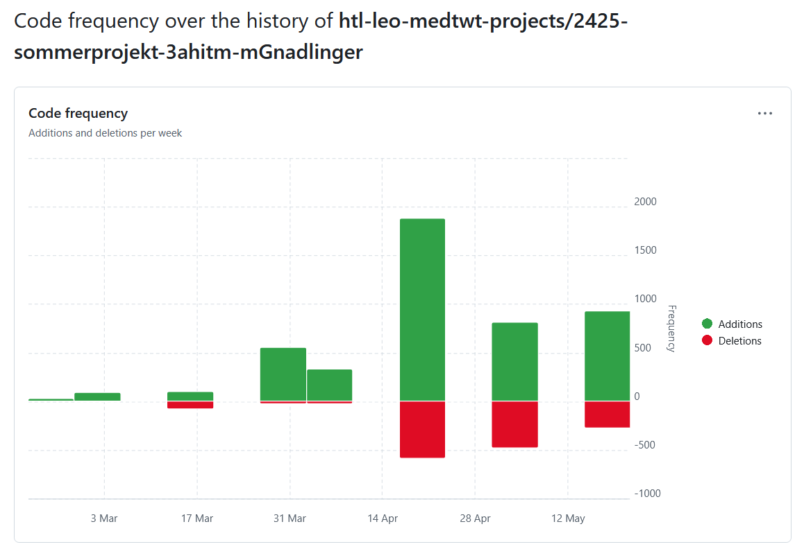

# Sprint Dokumentation

## Sommersemesterprojekt 2024/25

Miriam Gnadlinger 3AHITM  
EasyDreamDay -> [Link zu meinem GitHub-Repo](https://github.com/htl-leo-medtwt-projects/2425-sommerprojekt-3ahitm-mGnadlinger "Link zu meinem GitHub-Repo")

---

## Sprint #01

### Neuerungen

* Erarbeiten des "roten Fadens" im Projekt (Ablauf)
* Überarbeiten des Figma Prototypen
* Erarbeiten der Datenbankstruktur
* Anlegen aller Tabellen mittels Script

---

### Ziele bis zum nächsten Sprint

* Grundgerüst meiner Website (erstellen aller HTML Seiten)
* Gestalten der Startseite
* Registrieren als Braut (Hochzeit erstellen & Daten speichern)

---

#### Github Insights

##### Commit Insight

##### Code Frequency

---

### Anmerkungen

HTML Pages:

* index.html
* Profil.html
* Registrieren.html

## Sprint #02

### Neuerungen

* Überarbeiten der Datenbankstruktur
* Erstellen der Gäste Registrierung mit DB Speicherung
* Erstellen der Hochzeitsplanung mit dem Anfang der DB Speicherung
* Einfügen der Kalender JavaScript Library

---

### Ziele bis zum nächsten Sprint

* Fertigstellen der Speicherung von den Hochzeitsdaten
* Erstellen der User Profile für Gast und Planner

---

#### Github Insights

##### Commit Insight

##### Code Frequency

---

### Anmerkungen

Beim nächsten Mal vorher noch besser überlegen, welche Daten ich wann brauche bzw. wo sie gespeichert sind.
Um Logikprobleme während des Codens zu vermeiden.

## Sprint #03

### Neuerungen

* Fertigstellen der Speicherung von den Hochzeitsdaten (mit kleinem Fehler beim Speichern der Gäster)
* Login und Anfang der Profil Seite
* Einbinden von Session

---

### Ziele bis zum nächsten Sprint

* Fixen des Fehlers in der Gäste Speicherung
* Erstellen der Profilseite für Gast und Planner

---

#### Github Insights

##### Commit Insight

##### Code Frequency

---

### Anmerkungen

Ich habe sehr lange versucht den Fehler beim Speichern der Gäste zu fixen. Hat leider nicht funktioniert

## Sprint #04

### Neuerungen

* Fixen des Fehlers beim Speichern der Gäste
* Login und Logout Funktion
* Anzeigen der Profilseite für Gäste und die/den Planner/in

---

### Ziele bis zum nächsten Sprint

* Fertigstellen der Planner-Profilseite mit Todo's und Kalender
* Hochladen von Bildern am Hochzeitstag

---

#### Github Insights

##### Commit Insight

##### Code Frequency

---

